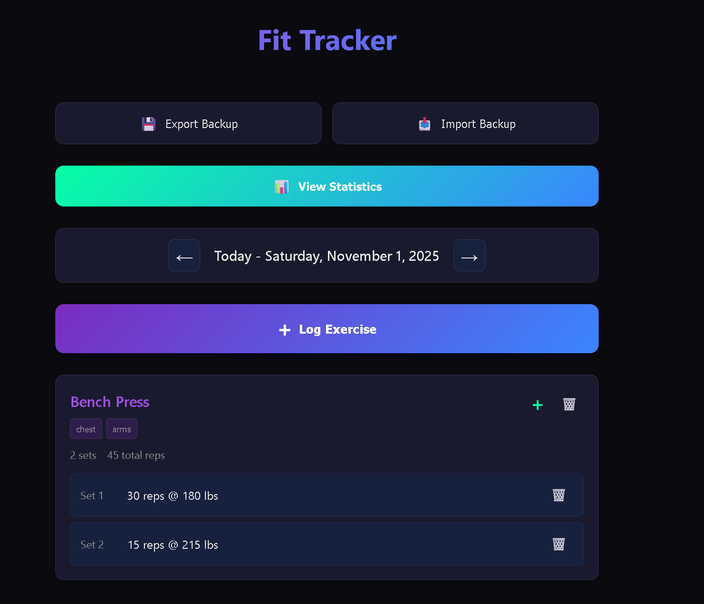
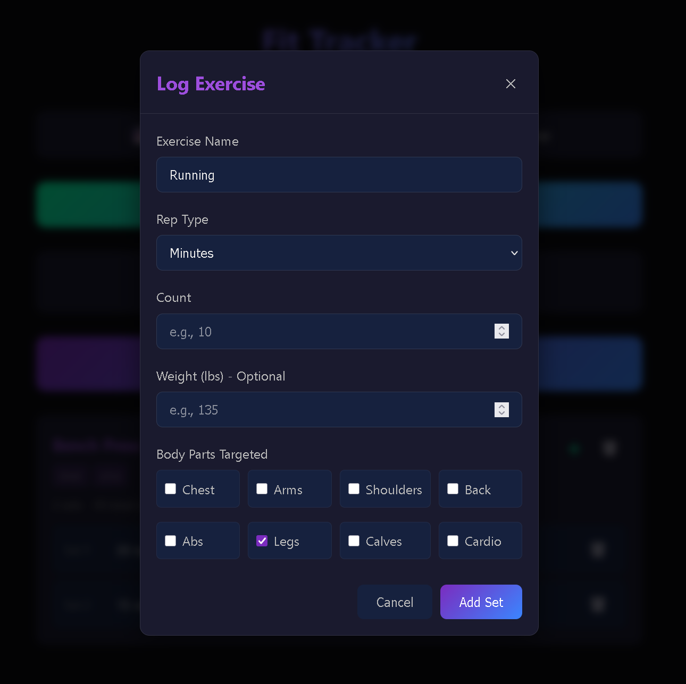
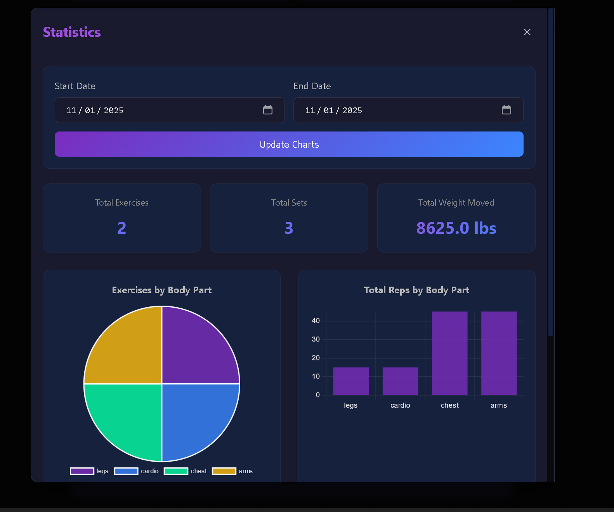

# Fit Tracker

A minimalist, self-hosted fitness tracking application for logging workouts, tracking progress, and visualizing your training data.


## Features

- **Exercise Logging**: Track sets, reps, and weight for any exercise
- **Body Part Categorization**: Tag exercises by muscle groups (chest, arms, legs, cardio, etc.)
- **Smart Exercise Memory**: Autocomplete previously logged exercises with saved rep types
- **Day-Based Navigation**: Log workouts for any date - past, present, or future (for planning)
- **Set Management**: Add multiple sets to exercises, delete individual sets, or entire workouts
- **Statistics Dashboard**: Visualize your training data with interactive charts
  - Exercises by body part (pie chart)
  - Total reps by body part (bar chart)
  - Total weight moved by exercise (bar chart)
  - Sets performed by exercise (bar chart)
  - Custom date range filtering
- **Data Backup & Restore**: Export and import your workout data as JSON files
- **Dark Theme**: Clean, modern design inspired by cyberpunk aesthetics
- **Responsive Design**: Works seamlessly on desktop and mobile devices
- **Local Storage**: All data stored in your browser - complete privacy
- **Self-Hosted**: Run it anywhere with Docker

## Screenshots

### Main Interface


### Logging an Exercise


### Statistics Dashboard


## Getting Started

### Prerequisites

- [Docker](https://docs.docker.com/get-docker/) and [Docker Compose](https://docs.docker.com/compose/install/)

### Installation

1. Clone the repository
```bash
git clone https://github.com/justind-dev/fit-tracker.git
cd fit-tracker
```

2. Start the application with Docker Compose
```bash
docker-compose up -d
```

3. Open your browser and navigate to `http://localhost:8081`

That's it! Your fit tracker is now running locally.

### Stopping the Application

```bash
docker-compose down
```

## Usage

### Logging Your First Exercise

1. Click the "Log Exercise" button
2. Enter exercise name (e.g., "Bench Press")
3. Select rep type (reps, minutes, miles, etc.)
4. Enter reps/count and optional weight
5. For new exercises, select targeted body parts
6. Click "Add Set" to log the set
7. Add more sets as needed, then click "Finish Exercise"

### Navigating Between Days

- Use the left/right arrows to move between dates
- The current date is highlighted as "Today"
- Log exercises for future dates to plan your workouts

### Managing Exercises

- **Add More Sets**: Click the "+" button on any exercise card to add additional sets
- **Delete Sets**: Click the trash icon on individual sets to remove them
- **Delete Exercise**: Click the trash icon in the exercise header to remove the entire workout

### Viewing Statistics

1. Click the "View Statistics" button
2. Adjust the date range to analyze specific periods
3. Click "Update Charts" to refresh the data
4. Scroll through the various charts and metrics

### Data Management

- **Export**: Click "Export Backup" to download a JSON backup file
- **Import**: Click "Import Backup" to restore from a backup file
- Backup files include all exercises, sets, and exercise type definitions
- Import will replace current data (backup recommended first)

## Technical Details

### Architecture

- **Frontend**: Vanilla JavaScript, HTML5, CSS3
- **Charts**: Chart.js for data visualization
- **Backend**: Static files served by nginx
- **Storage**: Browser localStorage (client-side only)
- **Deployment**: Docker container with nginx:alpine

### Data Storage

All workout data is stored locally in your browser's localStorage. This means:
- ✅ Complete privacy - no data leaves your device
- ✅ No server costs or maintenance
- ✅ Works offline after initial load
- ⚠️ Data is tied to your specific browser/device
- ⚠️ Clearing browser data will reset the app

### Port Configuration

The application runs on port 8081 by default. To change this, modify the `docker-compose.yml` file:

```yaml
ports:
  - "YOUR_PORT:80"
```

## Development

### Local Development Without Docker

1. Clone the repository
2. Serve the root directory with any static file server:

```bash
# Using Python
python -m http.server 8081

# Using Node.js serve
npx serve -p 8081

# Using PHP
php -S localhost:8081
```

### File Structure

```
├── index.html          # Main application HTML
├── app.js             # Core application logic
├── styles.css         # Styling and theme
├── docker-compose.yml # Docker deployment config
├── .dockerignore      # Docker ignore patterns
└── LICENSE           # GPL v3 License
```

## Contributing

1. Fork the repository
2. Create a feature branch (`git checkout -b feature/amazing-feature`)
3. Commit your changes (`git commit -m 'Add amazing feature'`)
4. Push to the branch (`git push origin feature/amazing-feature`)
5. Open a Pull Request

## License

This project is licensed under the GNU General Public License v3.0 - see the [LICENSE](LICENSE) file for details.

## Acknowledgments

- Built with simplicity and performance in mind
- Dark theme design influenced by cyberpunk aesthetics
- Designed for mobile-first usage and accessibility

## Support

If you encounter any issues or have feature requests, please [open an issue](https://github.com/justind-dev/fit-tracker/issues) on GitHub.

---

*Track your progress. Build your strength.*
